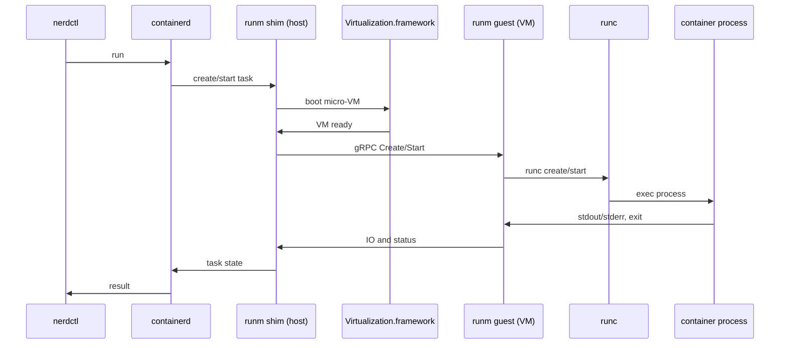

# runm

Experimental per-container VM adaptor for `runc` that runs Linux containers on macOS by delegating Linux-specific operations to a tiny guest VM.

> [!WARNING]
> These docs are largely under-construction. They serve primarily as a way to organize my own thoughts. If you are interested in learning more, please contact me directly.

## High-level notes

-   This project exploring how far a native macOS `containerd` stack can go by offloading Linux-only behavior to a guest VM.
-   Think of runm as “`runc` over vsock”: the Linux-only bits run inside a tiny VM - everything else remains standard `containerd` plumbing on the host.
-   The design mirrors industry patterns (Kata Containers; Apple’s Containerization) while integrating with `containerd` and `nerdctl` natively on macOS.

## Current status and limitations

-   `nerdctl run/exec` support is solid and is by far the most well-tested
-   `containerd`'s `native-snapshotter` currently requires a FUSE workaround via `bindfs`.
-   BuildKit and multi-container/pod semantics are not implemented here yet (e.g., a K8s “pod” would require grouping multiple containers into one VM, Kata-style).

### Commands / Frontend

-   ✅ `nerdctl run` and `nerdctl exec`
-   ✅ `nerdctl` container management
-   ⚠️ `nerdctl build`: buildkit integration works, not much else
-   🚧 `ctr`: untested
-   🚧 `kubectl`: untested, needs pod support

### Linux-only binaries running on macOS

-   ✅ `containerd`
-   ✅ `nerdctl`
-   ✅ `buildctl`
-   🚧 `buildkitd`: it runs and functions; I haven't completed a successful test yet

#### `nerdctl run/exec` specifics

-   [x] exit status returned to the host
-   [x] bind mounts
-   [x] read-only mounts (via `ro=true`)
-   [x] `-d` detached mode
-   [x] internet access (e.g., reach google.com)
-   [x] `-it` interactive mode
-   [x] `-e` environment variables
-   [x] `-w` working directory
-   [x] `-v` volumes
-   [x] `-p` ports
-   [x] `--tty` pty passthrough
-   [] `-u` user

## Quickstart (example)

#### Prereqs

-   `macFUSE` (kext)
-   `bindfs`
-   `Virtualization.framework`
-   `docker`
-   `go`
-   `iTerm2` (Terminal.app also works, but all logs are enhanced for iTerm)

#### steps

This will run a scenario that creates a container via `nerdctl run -d`, then runs a command via `nerdctl exec` that streams stdio back to the host at 1s intervals.

> [!NOTE]
> your password may be required to clean up any processes that have leaked.

-   Clone this repo
-   install all required forks to `../` (`go tool task fork:install:all`)
-   Open two panes in iTerm2
-   In the first pane, run `go tool task dev:containerd`
-   Take a break, it will take a while on the first run to build the kernel
-   Wait until `containerd` starts and the logs stop
-   In the second pane, run `go tool task dev:2025-07-05:01`
-   The second pane will show user-facing logs streaming from the demo container

## Forks and diffs

There are many forks that are required to run this project in its current state. The changes are a mix of required logical changes and (mostly) debugging. Until I have some time to put more TLC into them, I will lay out the important logical changes and what they enable.

> [!NOTE]
> current nerdctl and BuildKit logic indirectly assume their binaries are built on the same OS as the container runtime. The "[bug]" notes below refer to this assumption—even though it's not truly an upstream bug.

Last upstream sync: `2025-08-06`

1. `containerd` ([diff](https://github.com/containerd/containerd/compare/main...walteh:main))

    - **[bind mounts]** add `darwin` build support for the `core/mount` package by invoking `bindfs` via `exec.Cmd`

    - **[rootless]** ignore `EPERM` from `Lchown`/`Chown`

1. `nerdctl` ([diff](https://github.com/containerd/nerdctl/compare/main...walteh:main))

    - **[bug]** on `darwin/arm64`, use `oci.WithDefaultSpecForPlatform("linux/arm64")` when creating the OCI spec to prevent various "not supported" errors

    - **[bug]** refactor the mount parsing logic to use Linux-specific logic on macOS

1. `buildkit` ([diff](https://github.com/moby/buildkit/compare/master...walteh:master))

    - **[bug]** on `darwin/arm64`, generate OCI spec with explicit platform: `GenerateSpecWithPlatform(ctx, nil, "linux/arm64", ...)` to avoid missing `.Process.Args` inside the OCI spec

1. `fsutil` ([diff](https://github.com/tonistiigi/fsutil/compare/master...walteh:main))

    - **[rootless]** ignore `EPERM` from `Lchown`/`Chown`

1. `gvisor-tap-vsock` ([diff](https://github.com/containers/gvisor-tap-vsock/compare/main...walteh:main))

    - **[feature]** add raw `net.Listener` port-forwarding support

    - **[context/reliability]** pass context through missing places; return `ctx.Err()` on cancellation

## How it works (high level)

-   Host: a `containerd` shim on macOS
-   Guest: a tiny Linux VM runs unmodified `runc` over gRPC/vsock
-   IO/control: stdio, signals, exit codes flow over vsock
-   Isolation: one micro‑VM per container (no shared kernel)
-   Networking: per‑VM networking via gvisor‑tap‑vsock

To `containerd`, it looks like a normal OCI runtime; Linux syscalls execute inside the guest.

**Rough outline**



---

> [!IMPORTANT]
> The below docs are even more so under construction and incomplete.

## Unfinished notes / documentation

#### Why

macOS does not provide Linux namespaces, cgroups, or overlayfs. Traditional solutions (e.g., Docker Desktop) run a single Linux VM hosting all containers. Runm explores a Kata-like “VM-per-container” design on macOS using Apple’s Virtualization.framework: stronger isolation, clean lifecycles, and a native integration path. The approach aligns with Apple’s Containerization framework direction while remaining OCI- and containerd-oriented.

#### Architecture (deeper dive)

-   Host shim: adapted from `containerd`’s `containerd-shim-runc-v2`. It translates container lifecycle requests into gRPC calls to the guest.
-   Guest agent: receives requests over vsock and runs `runc` inside the VM. No changes to `runc` are required beyond extra debug.
-   IO and control: stdio, signals, and exit codes traverse vsock; networking for the guest is provided via gvisor-tap-vsock style forwarding.

#### Relationship to Kata Containers and Apple’s Containerization

-   Like Kata Containers, runm boots a minimal guest and runs the workload inside that VM for stronger isolation.
-   Like Apple’s Containerization, runm embraces one-VM-per-container on macOS using Virtualization.framework for fast boots and tight integration.
-   Unlike Kata’s K8s-focused “one VM per pod” model, runm currently treats each `nerdctl run` as its own sandbox VM.

#### Linux

Runm offloads Linux operations to a lightweight VM launched with Virtualization.framework.

-   Custom Linux kernel configuration lives in `./linux/kernel`.
-   Static `busybox` is built in `./linux/busybox`.

File system layout:

```
# initramfs
/init (symlink to `/runm-linux-mounter`)
/runm-linux-mounter
/bin/busybox
```

`runm-linux-mounter` is the only binary in the initramfs; it mounts the `mbin` squashfs containing the remaining guest binaries.

```
# rootfs
/bin/busybox
/mbin/runm-linux-init
/mbin/runc-test
/mbin/runm-linux-host-fork-exec-proxy
```

#### Snapshotting and macFUSE

On Linux, `containerd`’s native snapshotter relies on bind mounts (`mount --bind`). macOS has no `mount --bind`, so we use `bindfs` and a FUSE implementation to simulate bind mounts:

-   `bindfs` (OSS, GPL-2) + either `macFUSE` or `fuse-t` (free to use, closed-source) enable host-side bind-like behavior for the native snapshotter.
-   `macFUSE` kext requires reduced security mode; `fuse-t` avoids a kext but has proven unstable in practice.
-   macOS 15 introduced FSKit for user-space file systems; `macFUSE` v5 advertises support, but it has not worked out-of-the-box here yet.

Notes from experimentation:

-   `fuse-t` was significantly less stable (e.g., sporadic missing `glibc` files breaking dynamic linking).
-   `macFUSE (kext)` has been much more reliable.
